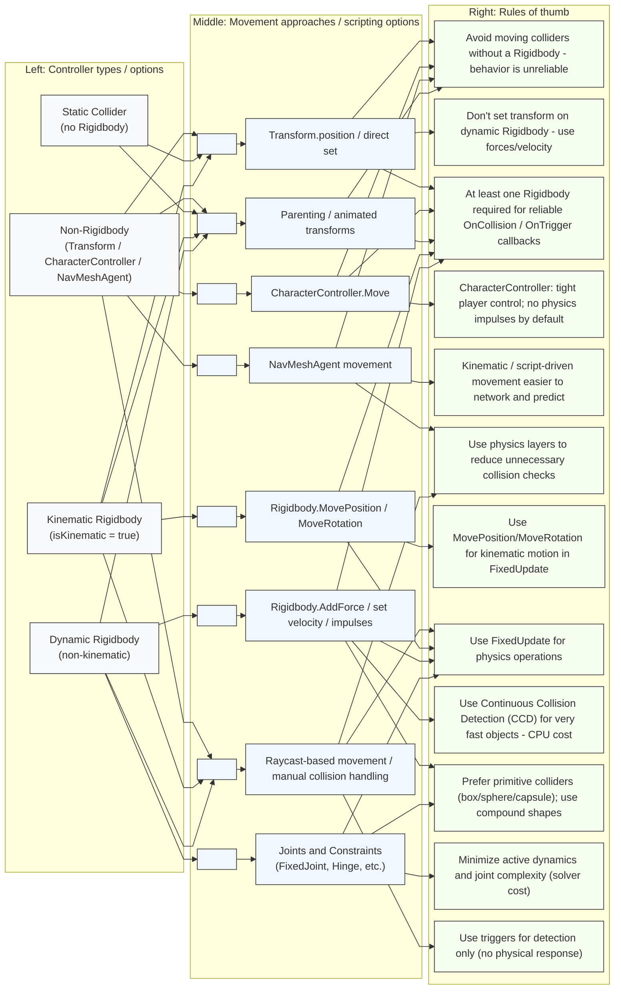

```mermaid
%%{init: {"flowchart": {"curve": "linear", "nodeSpacing": 18, "rankSpacing": 14}}}%%
flowchart LR
  %% Left column (types / options) - tightened and equidistant
  subgraph LEFT["Left: Controller types / options"]
    direction TB
    NR["Non-Rigidbody
(Transform / CharacterController / NavMeshAgent)"]
    SC["Static Collider
(no Rigidbody)"]
    KR["Kinematic Rigidbody
(isKinematic = true)"]
    DR["Dynamic Rigidbody
(non-kinematic)"]
  end

  %% Middle column (movement / scripting approaches) - include invisible anchors to guide entry points
  subgraph MIDDLE["Middle: Movement approaches / scripting options"]
    direction TB
    a_TM["."]
    TM["Transform.position / direct set"]
    a_CC["."]
    CC["CharacterController.Move"]
    a_NM["."]
    NM["NavMeshAgent movement"]
    a_PRT["."]
    PRT["Parenting / animated transforms"]
    a_RBCOLL["."]
    RBCOLL["Raycast-based movement / manual collision handling"]
    a_RM["."]
    RM["Rigidbody.MovePosition / MoveRotation"]
    a_RA["."]
    RA["Rigidbody.AddForce / set velocity / impulses"]
    a_STK["."]
    STK["Joints and Constraints
(FixedJoint, Hinge, etc.)"]
  end

  %% Right column (rules of thumb) - ordered to align with middle targets
  subgraph RIGHT["Right: Rules of thumb"]
    direction TB
    R10["Avoid moving colliders without a Rigidbody - behavior is unreliable"]
    R2["Don't set transform on dynamic Rigidbody - use forces/velocity"]
    R5["At least one Rigidbody required for reliable OnCollision / OnTrigger callbacks"]
    R4["CharacterController: tight player control; no physics impulses by default"]
    R12["Kinematic / script-driven movement easier to network and predict"]
    R8["Use physics layers to reduce unnecessary collision checks"]
    R3["Use MovePosition/MoveRotation for kinematic motion in FixedUpdate"]
    R1["Use FixedUpdate for physics operations"]
    R6["Use Continuous Collision Detection (CCD) for very fast objects - CPU cost"]
    R7["Prefer primitive colliders (box/sphere/capsule); use compound shapes"]
    R11["Minimize active dynamics and joint complexity (solver cost)"]
    R9["Use triggers for detection only (no physical response)"]
  end

  %% Style: hide anchor nodes (make them invisible and tiny)
  classDef invisible fill:transparent,stroke:transparent,color:transparent,font-size:1px;
  class a_TM,a_CC,a_NM,a_PRT,a_RBCOLL,a_RM,a_RA,a_STK invisible;

  %% Left -> Middle links (routed through anchors to encourage corner-like entry)
  NR --> a_TM
  NR --> a_CC
  NR --> a_NM
  NR --> a_PRT
  NR --> a_RBCOLL

  SC --> a_TM
  SC --> a_PRT

  KR --> a_RM
  KR --> a_TM
  KR --> a_PRT
  KR --> a_RBCOLL

  DR --> a_RA
  DR --> a_STK
  DR --> a_PRT
  DR --> a_RBCOLL

  %% Anchor -> actual middle node (keeps anchor placement just before visible node)
  a_TM --> TM
  a_CC --> CC
  a_NM --> NM
  a_PRT --> PRT
  a_RBCOLL --> RBCOLL
  a_RM --> RM
  a_RA --> RA
  a_STK --> STK

  %% Middle -> Right links (kept middle->right direction; straight lines)
  TM --> R10
  TM --> R2
  TM --> R5

  CC --> R4
  CC --> R10
  CC --> R5

  NM --> R12
  NM --> R10
  NM --> R8

  PRT --> R10
  PRT --> R5

  RBCOLL --> R8
  RBCOLL --> R9
  RBCOLL --> R1

  RM --> R3
  RM --> R1
  RM --> R5

  RA --> R1
  RA --> R6
  RA --> R7
  RA --> R5

  STK --> R11
  STK --> R7
  STK --> R1

  %% Visual grouping hints
  classDef leftCol fill:#f8f9fa,stroke:#333,stroke-width:1px;
  classDef midCol fill:#f0f7ff,stroke:#333,stroke-width:1px;
  classDef rightCol fill:#f7fff0,stroke:#333,stroke-width:1px;

  class NR,SC,KR,DR leftCol;
  class a_TM,a_CC,a_NM,a_PRT,a_RBCOLL,a_RM,a_RA,a_STK midCol;
  class TM,CC,NM,PRT,RBCOLL,RM,RA,STK midCol;
  class R1,R2,R3,R4,R5,R6,R7,R8,R9,R10,R11,R12 rightCol;
```
